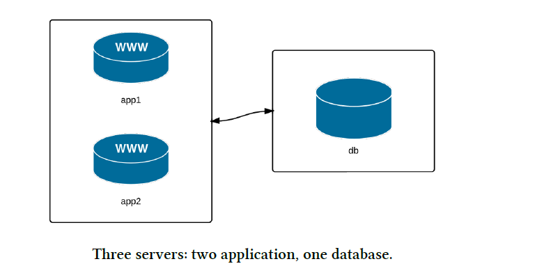

# ansible-local-test-machine

## Simple Server

[Simple Server Setup](./server/Vagrantfile)


### Windows

- For the Windows machine without wsl2, I create a separate ansible control machine and work from there

### Windows WSL2
- Install Vagrant on both the Linux machine on WSL and Windows
- In PowerShell run: `vagrant plugin install virtualbox_WSL2`
- In WSL linux, export these things (I would add them to `.bashrc` or `.zshrc` file:
  ```shell
  export VAGRANT_WSL_ENABLE_WINDOWS_ACCESS="1"
  export VAGRANT_WSL_WINDOWS_ACCESS_USER_HOME_PATH="/mnt/c/Users/username/"
  ```
- with this, we can use the ansible

### Linux

- For Linux, vagrant provision with Ansible might be easier

```ruby
Vagrant.configure("2") do |config|
  config.vm.box = "geerlingguy/rockylinux8"

  # Provisioning configuration for Ansible
  config.vm.provision "ansible" do |ansible|
    ansible.playbook = "playbook.yml"
  end
end
```
